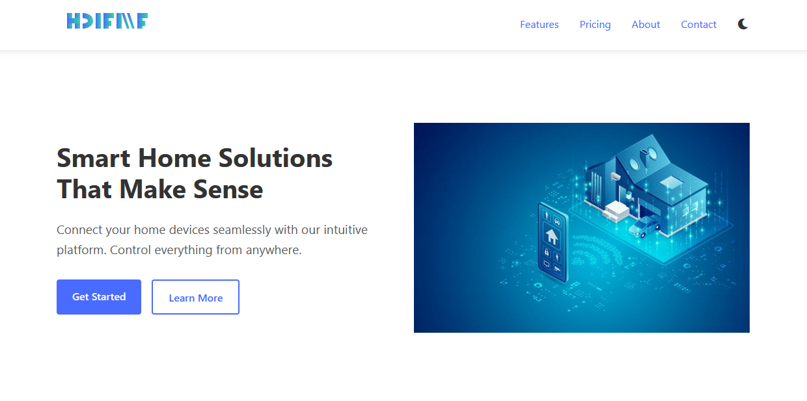

# Level2 Frontend Project - Emmanuel Udodirim

## Project Overview
This repository contains my Level 2 Frontend Development project, showcasing responsive web design, CSS styling techniques, and interactive elements using JavaScript.

## Live Demo
🌐 [View Live Site](https://emmytronix.github.io/Level2_Frontend_Emmanuel_Udodirim/)

## Repository
📁 [GitHub Repository](https://github.com/emmytronix/Level2_Frontend_Emmanuel_Udodirim)

## Project Screenshot


## Features
- Responsive design for various screen sizes
- Modern CSS styling and animations
- Interactive user interface elements
- Cross-browser compatibility

## Technologies Used
- HTML5
- CSS3

## Project Structure
```
├── index.html
├── css/
│   ├── style.css
│   └── [other CSS files]
├── images/
│   └── [image files]
└── README.md
```

## Getting Started
To view this project locally:

1. Clone the repository:
```bash
git clone https://github.com/emmytronix/Level2_Frontend_Emmanuel_Udodirim.git
```
2. Open the `index.html` file in your web browser

